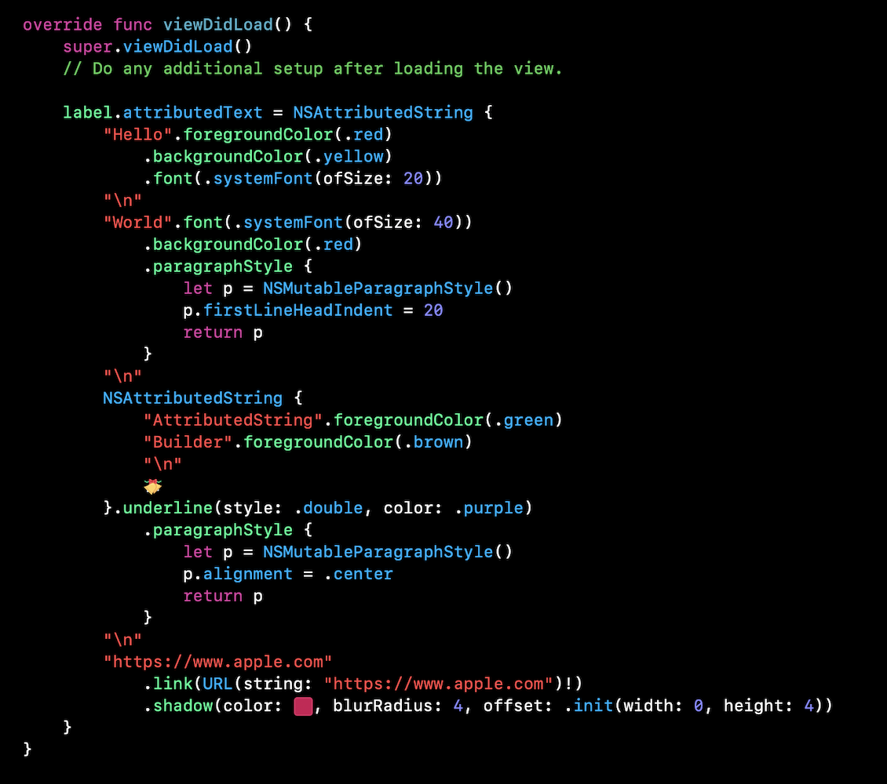
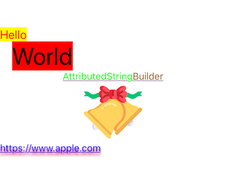

# BKAttributedStringBuilder
<!--
[](https://paypal.me/jinxiaolong) -->

Composing `NSAttributedString` with SwiftUI-style syntax, powered by the now pitching [Function Builder](https://forums.swift.org/t/function-builders/25167).

Project Link: [https://github.com/builderkit/BKAttributedStringBuilder](https://github.com/builderkit/BKAttributedStringBuilder)

## Features

| | Features |
| --- | --- |
| 🐦 | Open source library written in Swift 5.1 |
| 🍬 | SwiftUI-like syntax, supports if-else / ForEach |
| 💪 | Support most attributes in `NSAttributedString.Key` |
| 📦 | Distribution with Swift Package Manager |
| 🧪 | Fully tested code |

## How to use?

Traditionally we compose a `NSAttributedString` like this:

```Swift
let mas = NSMutableAttributedString(string: "")
mas.append(NSAttributedString(string: "Hello", attributes: [
    .foregroundColor: UIColor.red,
    .backgroundColor: UIColor.yellow,
    .font: UIFont.systemFont(ofSize: 20)
]))
mas.append(NSAttributedString(string: "\n"))
mas.append(NSAttributedString(string: "World", attributes: [
    .font: UIFont.systemFont(ofSize: 40),
    .paragraphStyle: {
        let p = NSMutableParagraphStyle()
        p.firstLineHeadIndent = 20
        return p
    }()
]))
// ...
```
Now, with **XLAttributedString**, we can use SwiftUI-like syntax to declare `NSAttributedString`:

```Swift
let usingEnglish = false
label.attributedText = NSAttributedString {
    "Hello".foregroundColor(.red)
        .backgroundColor(.yellow)
        .font(.systemFont(ofSize: 20))
    "\n"
    if usingEnglish {
        "World".font(.systemFont(ofSize: 40))
            .backgroundColor(.red)
            .paragraphStyle {
                let p = NSMutableParagraphStyle()
                p.firstLineHeadIndent = 20
                return p
            }
    } else {
        "せかい".font(.systemFont(ofSize: 40))
            .backgroundColor(.red)
    }
    "\n"
    ForEach(1 ..< 5) { 
      "\($0)" 
    	WhiteSpace(count: $0)
    }
}
```

## Requirements
Xcode 11. This project uses Swift 5.1 feature [Function Builder](https://forums.swift.org/t/function-builders/25167).

## Installation

### Swift Package
Open your project in Xcode 11, navigate to **Menu -> Swift Packages -> Add Package Dependency** and enter [https://github.com/builderkit/BKAttributedStringBuilder](https://github.com/builderkit/BKAttributedStringBuilder) to install.

### CocoaPods
Add `pod 'BKAttributedStringBuilder'` to your `Podfile`.

## Demo App
Open ***BKAttributedStringBuilder.xcworkspace*** and run `BKAttributedStringBuilderDemoApp` target. 

  


## Others
Some code are inspired by [ethanhuang13](https://github.com/ethanhuang13/NSAttributedStringBuilder)🙏.
